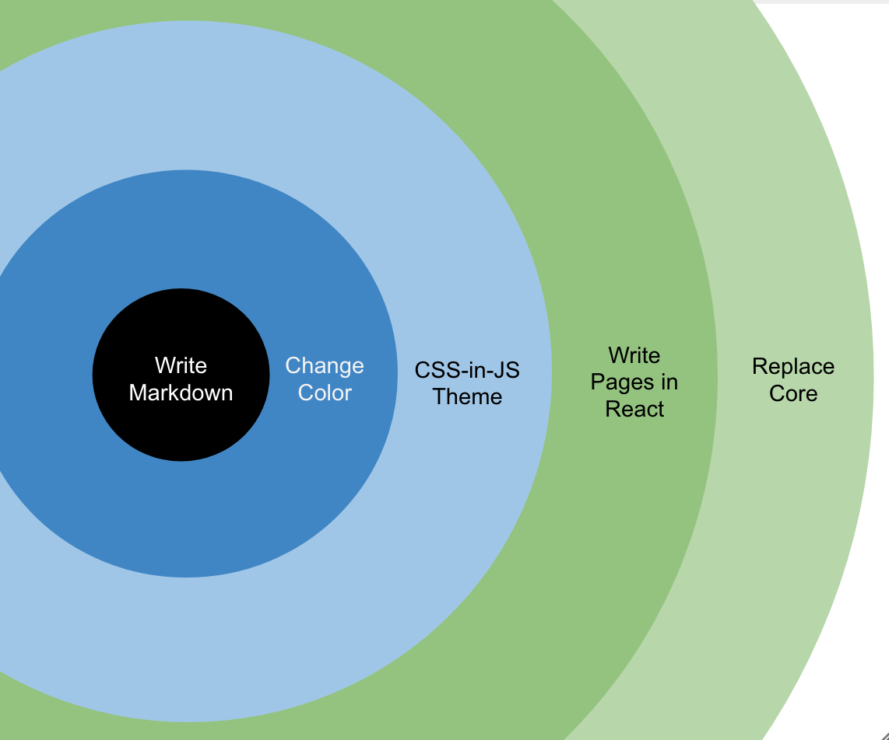

# Dochameleon

[](https://opensource.org/licenses/MIT)
[](https://badge.fury.io/js/dochameleon)
[](https://www.npmjs.com/package/dochameleon)
[]()

A Progressive Static Website Generator, built for Open Source documentation.

Start your website in less than 1 minute.

```bash
> npm install -g dochameleon-init
> dochameleon-init
> cd website
> npm run start
```

Progressive



1. [Just write markdown for documentation and blogging](http://dochameleon.io/docs/guide_site_creation.html)
2. [Change color scheme](http://dochameleon.io/docs/guide_color_scheme.html)
3. [Customize styling theme](http://dochameleon.io/docs/guide_theme.html)
4. [Write your own page](http://dochameleon.io/docs/guide_react.html)
5. [Replace core components](http://dochameleon.io/docs/guide_core.html)

Check [Dochameleon Site](http://dochameleon.io/) for its own documentation.
